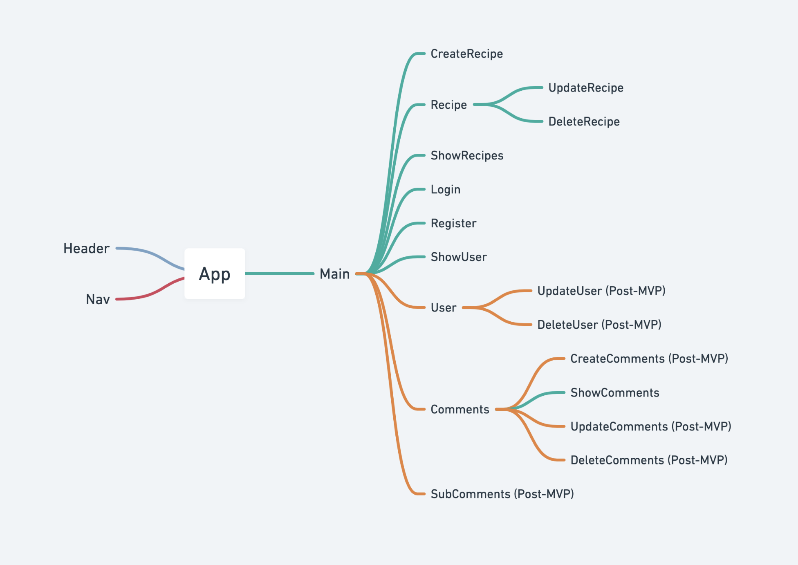

# Living La Vida, Vegan

- [Overview](#overview)
- [MVP](#mvp)
  - [Goals](#goals)
  - [Libraries and Dependencies](#libraries-and-dependencies)
  - [Client (Front End)](#client-front-end)
    - [Wireframes](#wireframes)
    - [Component Tree](#component-tree)
    - [Component Hierarchy](#component-hierarchy)
    - [Component Breakdown](#component-breakdown)
    - [Time Estimates](#time-estimates)
  - [Server (Back End)](#server-back-end)
    - [ERD Model](#erd-model)
- [Post-MVP](#post-mvp)
- [Code Showcase](#code-showcase)
- [Code Issues & Resolutions](#code-issues--resolutions)

<br>

## Overview

_**Living La Vida, Vegan** is an application that allows you to create and account where you can store all your favorite vegan recipes, whether it's your own yummy creation or a borrowed best._

<br>

## MVP

> The Minimum Viable Product should be a well-planned, easily-communicated product, ensuring that the client's deliverable will be achievable and meet specifications within the time frame estimated.

_The **Living La Vida, Vegan** MVP is to complete full CRUD capability for creating and add recipes to your account. The user will be able to create an account and view their recipes and those that others have shared via a tiled page feed._

<br>

### Goals

- _Create a user profile to store recipes_
- _Full CRUD workflow for recipe component_
- _Create seed data to setup API with_
- _Execute full-stack application development_

  <br>

### Libraries and Dependencies

|   Library    | Description                                                                                                 |
| :----------: | :---------------------------------------------------------------------------------------------------------- |
|    React     | _powers the application functionality/environment_                                                          |
| React Router | _allows application to be navigable without having to refresh the page_                                     |
|     Ruby     | _dynamic, open source programming language that focuses on simplifying code and making it more productive._ |
|    Rails     | _server-side web application framework_                                                                     |
|  Bootstrap   | _a component library that allows for easy styling using pre-built components_                               |

<br>

### Client (Front End)

#### Wireframes

- Desktop View

[Desktop Prototype](https://xd.adobe.com/view/9cfd32a9-50c8-4ffd-9f09-a59b4d61293e-c9ae/?fullscreen&hints=off)

- Mobile View (In Progress)

[Mobile Prototype](url)

#### Component Tree



#### Component Hierarchy

```structure

src
|__ App.js/
|__ Main/
       |__Main.jsx
       |__Main.css
|__ components/
    |__Header/
       |__Header.jsx
       |__Header.css
    |__ Nav/
       |__Nav.jsx
       |__Header.css
    |__ Login/
       |__Login.jsx
       |__Login.css
    |__ Register/
       |__Register.jsx
       |__Register.css
    |__Recipes/
       |__ CreateRecipe/
          |__ CreateRecipe.jsx
          |__ CreateRecipe.css
       |__ ShowRecipes/
          |__ ShowRecipes.jsx
          |__ ShowRecipes.css
       |__ Recipe/
          |__ Recipe.jsx
          |__ Recipe.css
       |__ UpdateRecipe/
          |__ UpdateRecipe.jsx
          |__ UpdateRecipe.jsx
       |__ DeleteRecipe/
          |__ DeleteRecipe.jsx
          |__ DeleteRecipe.css
    |__Users/
       |__ CreateUser/
          |__ CreateUser.jsx
          |__ CreateUser.css
       |__ ShowUser/
          |__ ShowUser.jsx
          |__ ShowUser.css
       |__ UpdateUser/
          |__ UpdateUser.jsx
          |__ UpdateUser.jsx
       |__ DeleteUser/
          |__ DeleteUser.jsx
          |__ DeleteUser.css
    |__Comments/
      |__ CreateComments/
          |__ CreateComments.jsx
          |__ CreateComments.css
       |__ ShowComments/
          |__ ShowComments.jsx
          |__ ShowComments.css
       |__ UpdateComments/
          |__ UpdateComments.jsx
          |__ UpdateComments.jsx
       |__ DeleteComments/
          |__ DeleteComments.jsx
          |__ DeleteComments.css
|__ services/
    |__api-helper.js
    |__recipes.js
    |__users.js
    |__comments.js


```

#### Component Breakdown

|   Component    |    Type    | state | props | Description                                                                                                           |
| :------------: | :--------: | :---: | :---: | :-------------------------------------------------------------------------------------------------------------------- |
|     Header     | functional |   n   |   n   | _The header will contain the navigation and logo._                                                                    |
|      Nav       | functional |   y   |   n   | _The navigation will provide a link to each of the pages and have icons that link to info about me and my portfolio._ |
|      Main      | functional |   y   |   y   | _The main will render the site using cards in flexbox and house the methods to be passed as props._                   |
| Login/Register | functional |   n   |   y   | _The user will be able to register for and login into their account._                                                 |
|    Recipes     | functional |   n   |   y   | _The tiles will render the recipes info via props._                                                                   |
|      User      | functional |   n   |   y   | _The user will be able to create their account and access a profile._                                                 |
|    Comments    | functional |   n   |   y   | _The comments will render with the recipes._                                                                          |

#### Time Estimates

| Task                            | Priority | Estimated Time | Time Invested | Actual Time |
| ------------------------------- | :------: | :------------: | :-----------: | :---------: |
| Add Sign Up/Login Form          |    L     |     2 hrs      |    TBD hrs    |     TBD     |
| Create Front-End CRUD Actions   |    H     |     20 hrs     |    TBD hrs    |     TBD     |
| Create Back-End CRUD Actions    |    H     |     12 hrs     |    TBD hrs    |     TBD     |
| Create seed data                |    M     |     6 hrs      |    TBD hrs    |     TBD     |
| Add Front-End CSS (boilerplate) |    L     |     4 hrs      |    TBD hrs    |     TBD     |
| Add Front-End CSS (advanced)    |    H     |     12 hrs     |    TBD hrs    |     TBD     |
| **Post-MVP**                    |    M     |     25 hrs     |    TBD hrs    |     TBD     |
| QA & Test application           |    M     |     6 hrs      |    TBD hrs    |     TBD     |
| Deployment                      |    H     |     5 hrs      |    TBD hrs    |     TBD     |
| TOTAL                           |          |     73 hrs     |    TBD hrs    |     TBD     |

<br>

### Server (Back End)

#### ERD Model


<br>

---

## Post-MVP

- _Implement full CRUD on the User and Comments components_
- _Include authentication for Users_
- _Advanced CSS with hovers and possible changes varying state_
- _Build out favorites/likes functionality_

---

## Code Showcase

> Use this section to include a brief code snippet of functionality that you are proud of and a brief description.

## Code Issues & Resolutions

> Use this section to list of all major issues encountered and their resolution.
